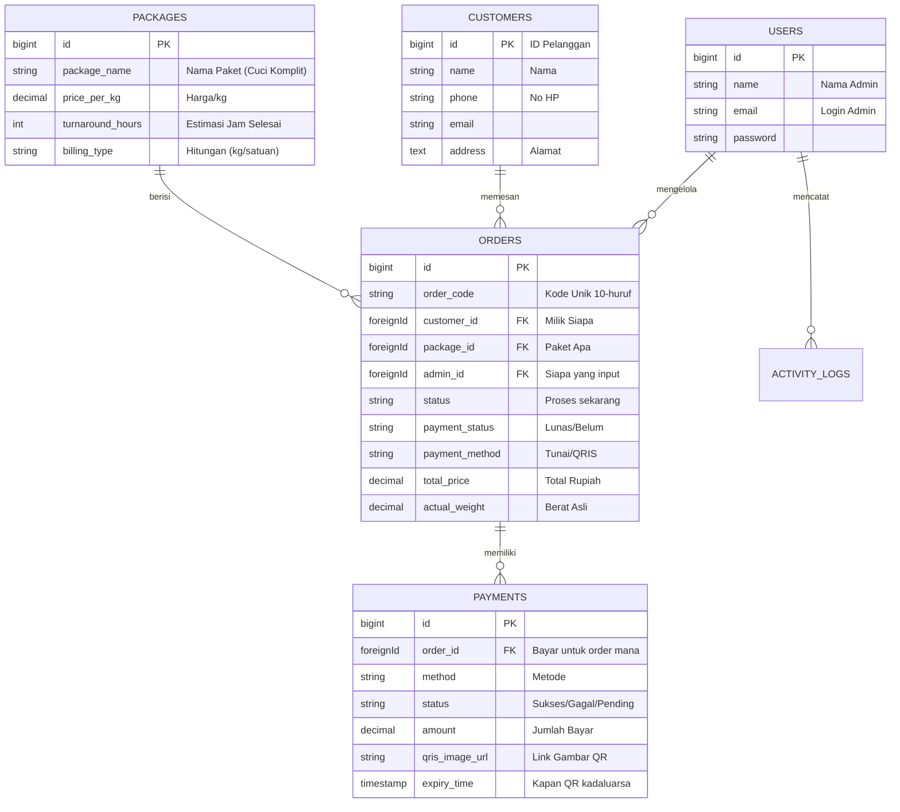

# Skema Database (Struktur Data)

Dokumen ini menjelaskan tabel-tabel yang ada di database. Bayangkan ini sebagai daftar "Buku Catatan" yang dimiliki laundry.

## Diagram Hubungan Antar Tabel (ERD)
Gambar di bawah menjelaskan bagaimana satu data berhubungan dengan data lain.

---

## Penjelasan Tabel

### 1. Users (Admin)
Daftar orang yang bisa login ke halaman admin.
*   `email`: Digunakan untuk login.
*   `password`: Kata sandi (rahasia).

### 2. Packages (Daftar Menu)
Daftar layanan yang dijual. Contoh: "Cuci Kering", "Setrika Saja".
*   `price_per_kg`: Harga dasar.
*   `turnaround_hours`: Berapa lama cucian biasanya selesai (contoh: 48 jam).

### 3. Customers (Pelanggan)
Buku telepon pelanggan. Ini tersimpan otomatis saat membuat pesanan baru.

### 4. Orders (Pesanan)
Tabel paling penting. Mencatat setiap transaksi laundry.
*   `order_code`: Kode acak (misal: `TRX998877`) yang dikasih ke pelanggan untuk cek resi.
*   `status`: Posisi cucian sekarang (Pending -> Proses -> Selesai).
*   `payment_status`: Status uang (Paid = Lunas, Unpaid = Belum).

### 5. Payments (Riwayat Pembayaran)
Mencatat setiap kali ada percobaan pembayaran.
*   Kenapa dipisah dari Order? Karena satu order bisa punya banyak percobaan bayar (misal: kemarin QRIS gagal, hari ini coba lagi QRIS baru).
*   Menyimpan link gambar QRIS dan waktu kadaluarsanya.
