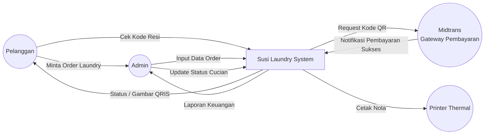
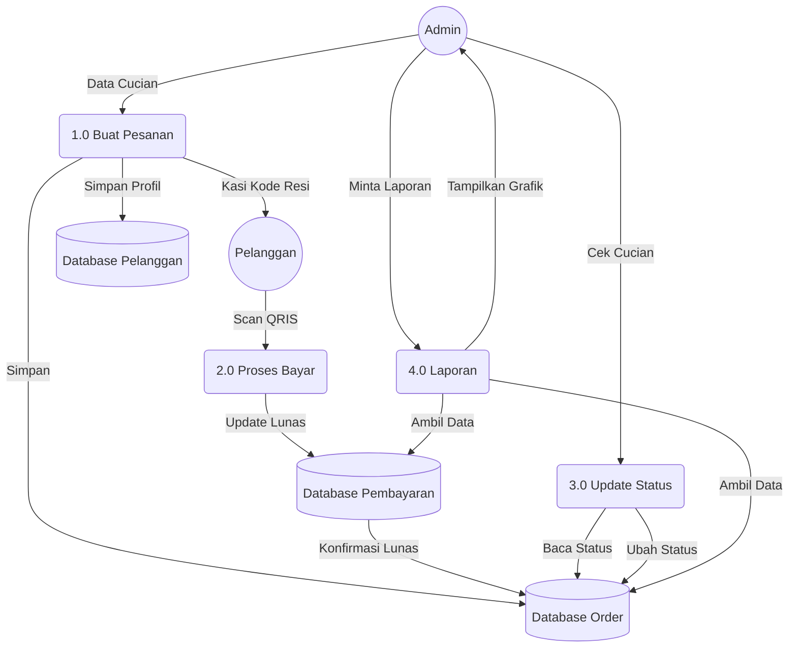

# Diagram Alur Data (DFD)

Diagram ini menjelaskan bagaimana **Data** mengalir keluar masuk sistem Susi Laundry.

## Level 0 (Gambaran Besar)

```mermaid
graph LR
    Customer((Pelanggan))
    Admin((Admin))
    System[Susi Laundry System]
    PaymentGateway((Midtrans\nGateway Pembayaran))
    Printer((Printer Thermal))

    %% Customer Interactions
    Customer -- "Minta Order Laundry" --> Admin
    Customer -- "Cek Kode Resi" --> System
    System -- "Status / Gambar QRIS" --> Customer
    
    %% Admin Interactions
    Admin -- "Input Data Order" --> System
    Admin -- "Update Status Cucian" --> System
    System -- "Laporan Keuangan" --> Admin
    
    %% Gateway Interactions
    System -- "Request Kode QR" --> PaymentGateway
    PaymentGateway -- "Notifikasi Pembayaran Sukses" --> System
    
    %% Output
    System -- "Cetak Nota" --> Printer
```

## Level 1 (Rincian Proses)

```mermaid
graph TD
    %% Entities
    Admin((Admin))
    Customer((Pelanggan))
    
    %% Processes
    P1(1.0 Buat Pesanan)
    P2(2.0 Proses Bayar)
    P3(3.0 Update Status)
    P4(4.0 Laporan)
    
    %% Data Stores
    DB_Orders[(Database Order)]
    DB_Customers[(Database Pelanggan)]
    DB_Payments[(Database Pembayaran)]
    
    %% Flows
    Admin -->|Data Cucian| P1
    P1 -->|Simpan| DB_Orders
    P1 -->|Simpan Profil| DB_Customers
    P1 -->|Kasi Kode Resi| Customer
    
    Customer -->|Scan QRIS| P2
    P2 -->|Update Lunas| DB_Payments
    DB_Payments -->|Konfirmasi Lunas| DB_Orders
    
    Admin -->|Cek Cucian| P3
    P3 -->|Baca Status| DB_Orders
    P3 -->|Ubah Status| DB_Orders
    
    Admin -->|Minta Laporan| P4
    P4 -->|Ambil Data| DB_Orders
    P4 -->|Ambil Data| DB_Payments
    P4 -->|Tampilkan Grafik| Admin
```
