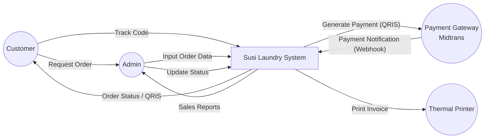
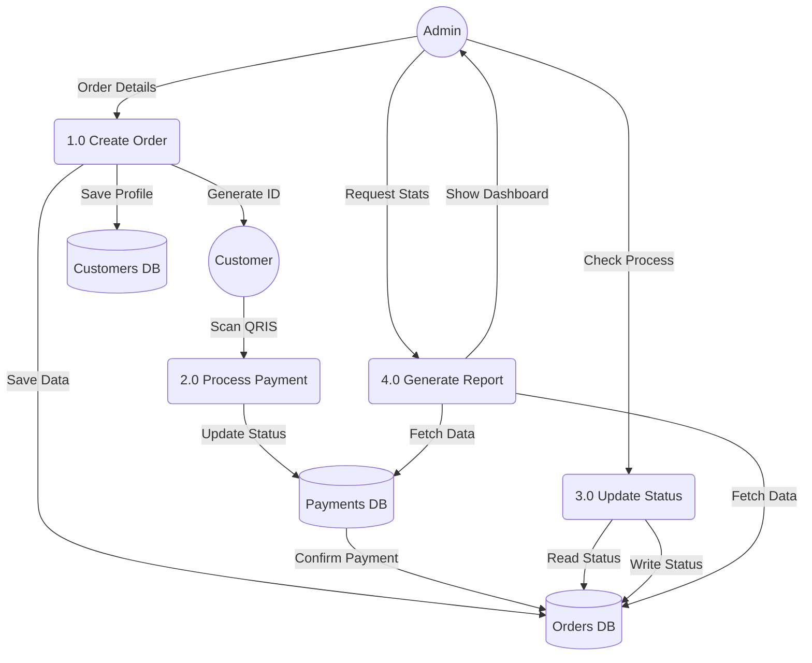

# Data Flow Diagram (DFD) - Level 0 (Context)

```mermaid
graph LR
    Customer((Customer))
    Admin((Admin))
    System[Susi Laundry System]
    PaymentGateway((Payment Gateway\nMidtrans))
    Printer((Thermal Printer))

    %% Customer Interactions
    Customer -- "Request Order" --> Admin
    Customer -- "Track Code" --> System
    System -- "Order Status / QRIS" --> Customer
    
    %% Admin Interactions
    Admin -- "Input Order Data" --> System
    Admin -- "Update Status" --> System
    System -- "Sales Reports" --> Admin
    
    %% Gateway Interactions
    System -- "Generate Payment (QRIS)" --> PaymentGateway
    PaymentGateway -- "Payment Notification (Webhook)" --> System
    
    %% Output
    System -- "Print Invoice" --> Printer
```

# DFD Level 1 (Order Processing)

```mermaid
graph TD
    %% Entities
    Admin((Admin))
    Customer((Customer))
    
    %% Processes
    P1(1.0 Create Order)
    P2(2.0 Process Payment)
    P3(3.0 Update Status)
    P4(4.0 Generate Report)
    
    %% Data Stores
    DB_Orders[(Orders DB)]
    DB_Customers[(Customers DB)]
    DB_Payments[(Payments DB)]
    
    %% Flows
    Admin -->|Order Details| P1
    P1 -->|Save Data| DB_Orders
    P1 -->|Save Profile| DB_Customers
    P1 -->|Generate ID| Customer
    
    Customer -->|Scan QRIS| P2
    P2 -->|Update Status| DB_Payments
    DB_Payments -->|Confirm Payment| DB_Orders
    
    Admin -->|Check Process| P3
    P3 -->|Read Status| DB_Orders
    P3 -->|Write Status| DB_Orders
    
    Admin -->|Request Stats| P4
    P4 -->|Fetch Data| DB_Orders
    P4 -->|Fetch Data| DB_Payments
    P4 -->|Show Dashboard| Admin
```
