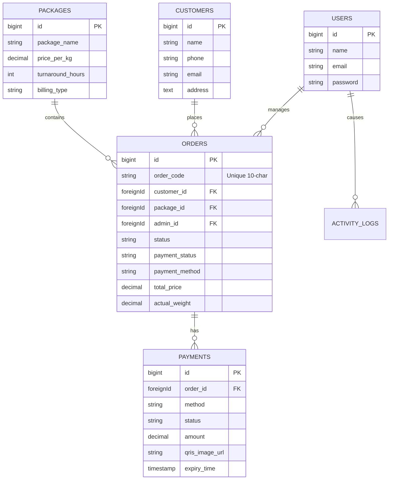

# Entity Relationship Diagram (ERD)

This diagram visualizes the relationships between the database tables.

## Relationship Logic
*   **One Admin (User)** can manage **Many Orders**.
*   **One Customer** can have **Many Orders**.
*   **One Package** can be applied to **Many Orders**.
*   **One Order** can have **Many Payment Attempts** (e.g., failed QRIS, then success).
