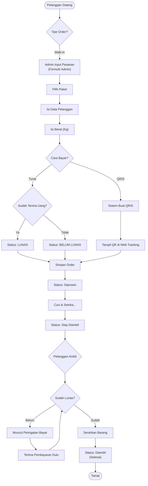

# Diagram Alur Pesanan (Flowchart)

Gambar ini menjelaskan langkah-langkah dari pelanggan datang sampai cucian selesai.

## Penjelasan Singkat
1.  **Input**: Admin memasukkan data.
2.  **Bayar**:
    *   Kalau **Tunai**, admin konfirmasi langsung.
    *   Kalau **QRIS**, sistem buatkan kodenya, pelanggan scan sendiri nanti.
3.  **Proses**: Baju dicuci.
4.  **Kunci Pengambilan**: Barang **TIDAK BISA** diambil kalau sistem bilang "Belum Lunas". Harus dilunasi dulu baru sistem membolehkan status berubah jadi "Diambil".
